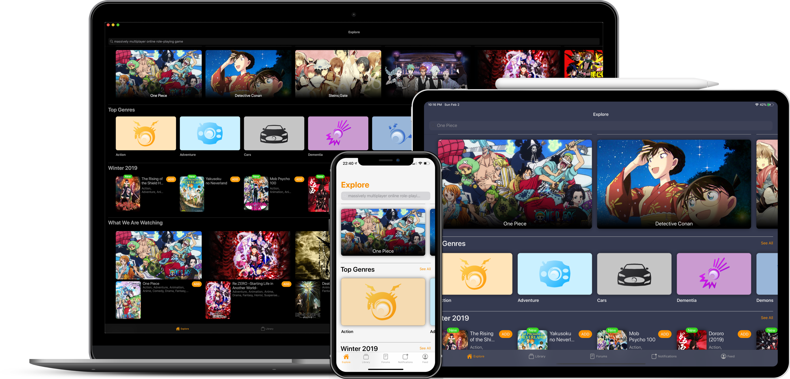

  <h1>Kurozora</h1>
  

      <em>Your one-stop shop for everything anime!</em>
  

  <a href="https://kurozora.app">Website</a>
  &nbsp;&nbsp;•&nbsp;&nbsp;
  <a href="https://apple.co/3CsQlKq">App Store</a>
  &nbsp;&nbsp;•&nbsp;&nbsp;
  <a href=“#”>Play Store (TBA)</a>
  &nbsp;&nbsp;•&nbsp;&nbsp;
  <a href="https://addons.mozilla.org/en-US/firefox/addon/kurozora">Web Extension</a>
  &nbsp;&nbsp;•&nbsp;&nbsp;
  <a href="https://discord.gg/f3QFzGqsah">Discord</a>
  

# Kurozora  [-white.svg?style=flat&logo=Android)]()   

Kurozora is an open-source anime, manga, game and music discovery service that offers unlimited access to a growing collection of over 90,000 Japanese media combined — featuring new releases, award winners, and beloved favorites. Kurozora also includes episodes, characters, voice actors, staff, studios, and much more — all without ads. You can track what you're watching, reading, playing, and listening to on iPhone, iPad, iPod touch, Mac, and through any web browser.

# 🎯Goal

Kurozora’s mission consist of three parts that work together to improve the user’s experience while also keeping the industry healthy. These parts are:

### 1. Offering better anime streaming services

#### Problem
Back in 2016, I was fed up with the state of anime streaming: pricy subscriptions, limited catalogs, and poor quality options. These are true even today. As a result, many anime fans turn to illegal streaming sites for a better experience. At Kurozora, we aim to change that.

#### Goal
Our goal is to combine the best of legal and illegal services. We’ll offer legal streaming with affordable subscription plans that cater to different budgets, a free tier with better experience and video quality, provide all anime to all users regardless of location, and ensure safe streaming without spicy ads, pop-ups, and malware.

### 2. Be a reliable and modern anime tracking service

#### Problem
Back in 2017 Aozora, an app that I was an admin of, was sold off to Kitsu. In my opinion they did a poor job of the transition from Aozora to Kitsu, but what’s worse is they did a poor job of keeping what made the Aozora app good, alive. Additionally, many existing tracking services have outdated user experiences and poorer mobile apps. There’s a lack of innovation.

#### Goal
We understand the importance of having a reliable and up-to-date tracking service for your anime, manga, and game collections. We will improve the tracking experience for everyone, with features that matter to anime, manga and game fans like you. We’ll offer modern user experiences and user interfaces, while making sure it’s as intuitive and easy to use.

### 3. Support the anime industry

#### Problem
During the same time back in [2016](https://www.animenewsnetwork.com/interest/2016-12-07/young-animators-npo-launches-crowdfunding-campaign/.109566) (and recently in [2020](https://www.kickstarter.com/projects/animatorsupporters/2020-new-anime-making-system-project)), there were kickstarters for collecting funds to give to anime artists, since they didn't make enough money. Also in the years prior, a lot of beloved anime studios went bankrupt (Manglobe </3) due to financial reasons. Unfortunately, the current system often means that distributors and licensors get the biggest slice of the pie, leaving the artists and studios with little.

#### Goal
We love anime, manga, and games. We know that the people who create them deserve fair compensation for their hard work. With Kurozora, we want to level the playing field. Our goal is to have more money go directly to the studios and animators who create the content that we all love.

Join us on our mission to improve the anime streaming and tracking experience while supporting the industry. Together, we can make a difference.

# 🤝Contributing

First of all thank you so much for considering to contribute to Kurozora. As an open source project, all contributions are welcome! Whether you're a developer, designer, or simply a fan of Japanese media, there are many ways to get involved:

- resolve an open issues
- add new features/improve existing ones
- help lower running costs
- help grow the community
- donate through [Patreon](https://patreon.com/kurozora) or make an In-App Purchase
- anything else you believe will contribute to Kurozora’s growth

# 🛡️Security

If you happen to find a security vulnerability, we would appreciate you letting us know at kurozoraapp@gmail.com or by DM-ing the Guildmaster on [Discord](https://discord.gg/f3QFzGqsah), and allowing us to respond before disclosing the issue publicly.

# 💌Getting in Touch

If you…

- are having trouble with Kurozora
- don’t know where to start with contributing
- want to stay up-to-date with Kurozora
- have any questions or feedback
- want to casually talk to the team and other community members
- just feel like it, cause why not?

please don't hesitate to get in touch! Join our [Discord](https://discord.gg/f3QFzGqsah) server where you'll find information on how to get help, report bugs or issues and talk with us or other community members.

# ⚖️License

Kurozora is an Open Source project that is mainly covered by the [GNU General Public License v3.0](LICENSE), unless stated otherwise in the README of a project.